# Ejercicios realizados en Docker

### 1. Se crea una cuenta en Docker Hub y posteriormente un repositorio.

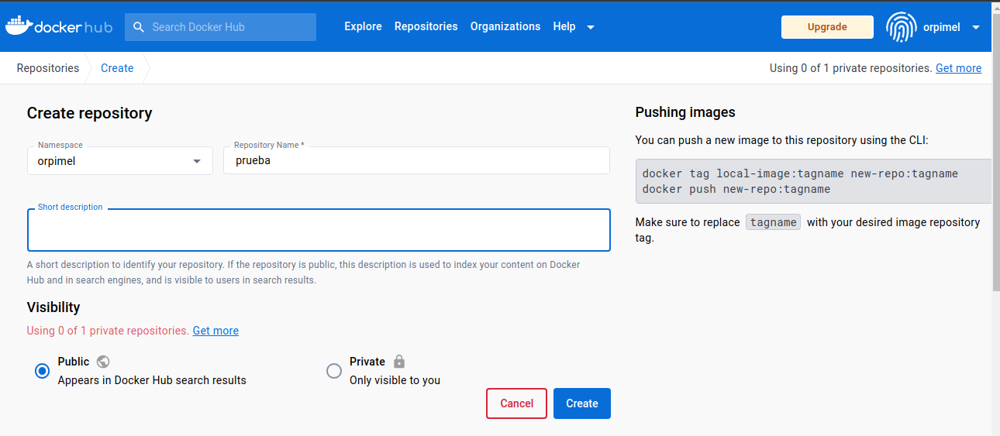

### 2. Se crea un contenedor con la imagen de Apache y que escuche en el puerto 8080. Luego se valida su funcionamiento.

#### 2.1 Se crea un archivo Dockerfile con el siguiente contenido:

``` dockerfile
FROM httpd:2.4
COPY index.html /usr/local/apache2/htdocs/
EXPOSE 80
```

#### 2.2 Se crea un archivo index.html con el siguiente contenido:

``` html
<!DOCTYPE html>
<html lang="en">
    <head>
        <meta charset="UTF-8">
        <title>Apache</title>
    </head>

    <body>
        <h1>Hola Mundo!</h1>
    </body>
</html>
```

##### Estructura final del proyecto

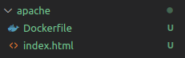

### 3. Se inicia sesión.

``` bash
docker login
```
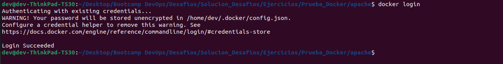

### 4. Se crea una imagen con el nombre de "apache".

``` bash
docker build -t apache:v1.0.0 .
```

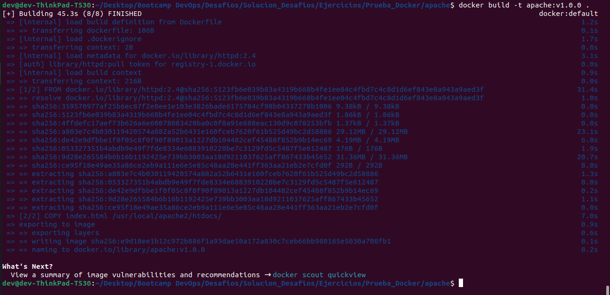

``` bash
docker scout quickview
```


### 5. Se crea un contenedor con el nombre de "apache" y se valida su funcionamiento.

``` bash
docker run -d -p 8080:80 --name apache apache:v1.0.0
```


### 6. Se valida el funcionamiento del contenedor.

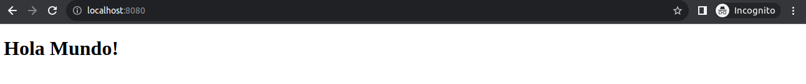

### 7. Se listan las imágenes creadas.

``` bash
docker images
```

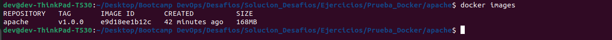

### 8. Se listan los contenedores creados.

``` bash
docker ps -a
```

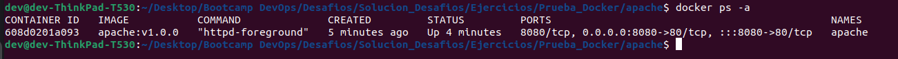

### 9. Se detiene el contenedor.

``` bash
docker stop apache
```

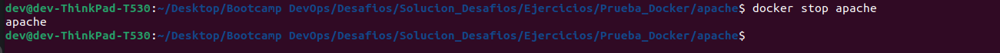

### 10. Se inicia nuevamente el contenedor.

``` bash
docker start apache
```

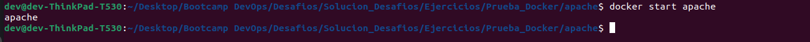

### 11. Se imprimen los logs del contenedor.

``` bash
docker logs apache
```

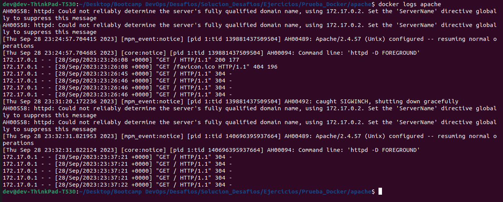

### 12. Se ingresa al contenedor.

``` bash
docker exec -it apache bash
```

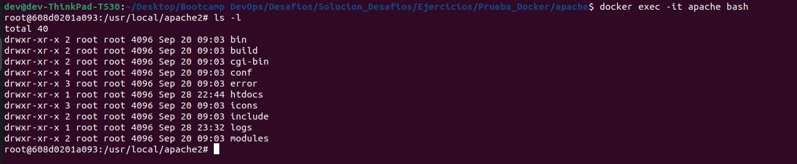

### 13. Se detiene el contenedor y se elimina.

``` bash 
docker stop apache
docker rm apache
``` 

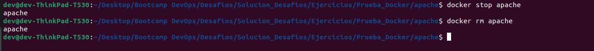

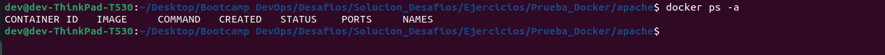

### 14. Se sube la imagen al repositorio creado en hub.docker.com.

#### 14.1 Se etiqueta la imagen.

``` bash 
docker tag apache:v1.0.0 <nombre_usuario_cuenta_hub.docker.com>/prueba:v1.0.0
``` 

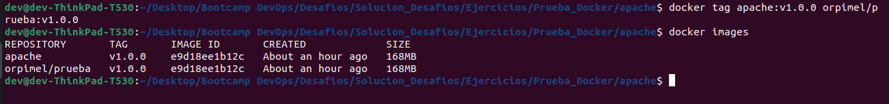

#### 14.2 Se sube la imagen.

``` bash
docker push <nombre_usuario_cuenta_hub.docker.com>/prueba:v1.0.0
```

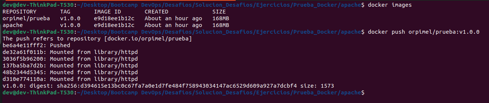

#### 14.3 Se valida la imagen en el repositorio.

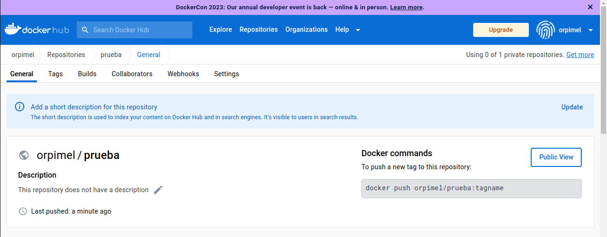

### 15. Se elimina la imagen creada.

``` bash
docker rmi apache:v1.0.0
```

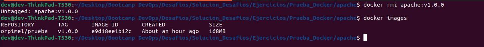

### 15.1 Se eliminan todas las imágenes.

``` bash
docker rmi $(docker images -q)
```

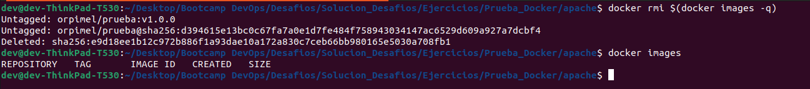

### 16. Se crea un contenedor con la imagen que se subió al respositorio de hub.docker.com.

``` bash
docker run -d -p 8080:80 --name apache <nombre_usuario_cuenta_hub.docker.com>/prueba:v1.0.0
```

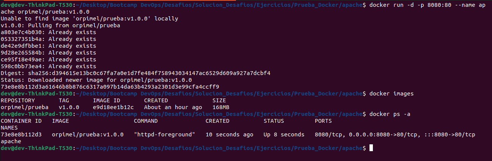

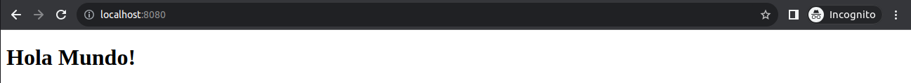

#### 16.1 Se eliminan todos los contenedores junto con todas las imágenes.

``` bash
docker stop $(docker ps -q)
docker rm $(docker ps -a -q)
docker rmi $(docker images -q)
```

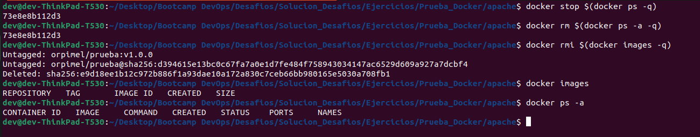

### 17. Se descarga la imagen subida al repositorio de hub.docker.com.

``` bash
docker pull <nombre_usuario_cuenta_hub.docker.com>/prueba:v1.0.0
```

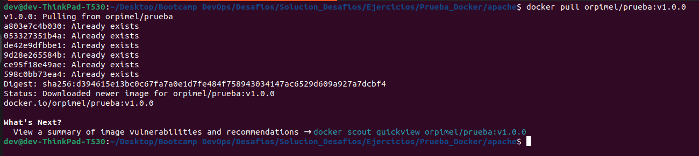

