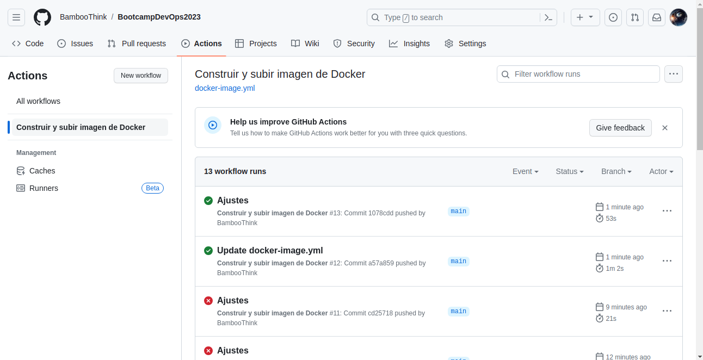
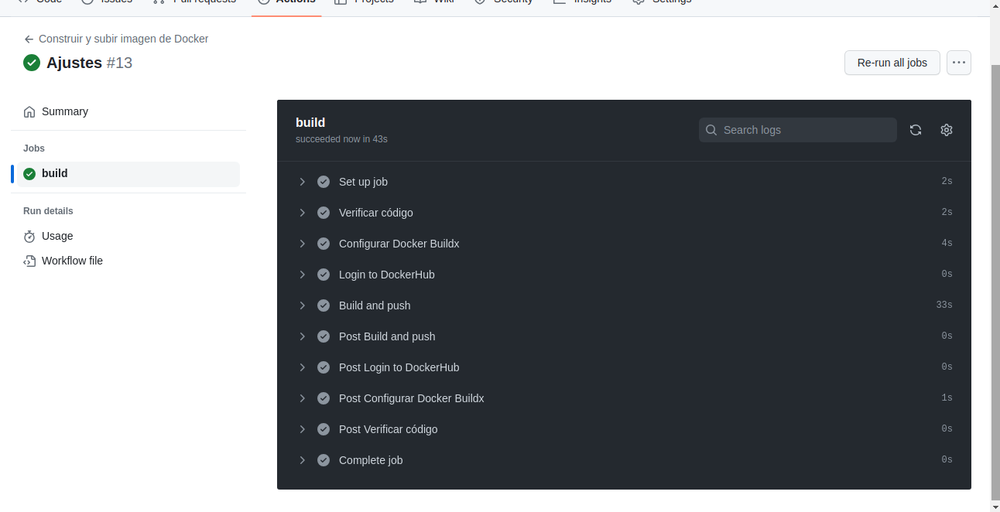
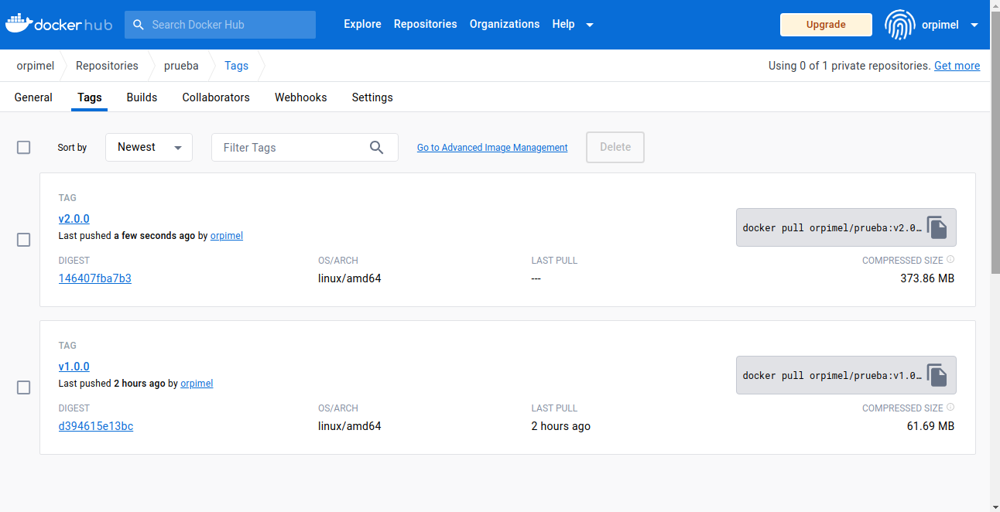

# Ejercicio en GitHub Actions

Se construirá una imagen de Docker y luego se subirá al repositorio creado en la registry de DockerHub.

### 1. Se crea una Action, en este caso se selecciona _Docker image_.

### 2. Se crea el Workflow.

### 3. Se configuran las variables para el login, por lo cual deben ser de tipo _secret_.

### 4. Se ejecuta el Workflow.

### 5. Se verifica la ejecución del Workflow.

### 6. Se verifica la imagen en DockerHub.

