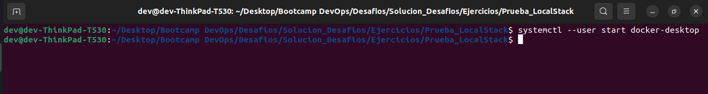
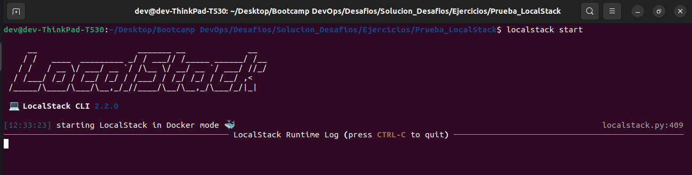
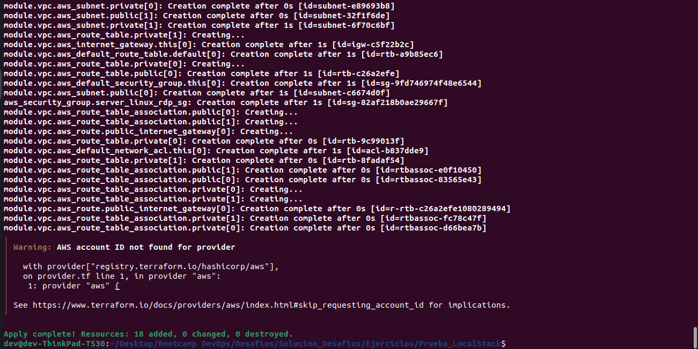

# Prueba de LocalStack

## Descripción

1. Se instala Docker y LocalStack en el equipo local.
2. Se inicializa Docker (`systemctl --user start docker-desktop`) para levantar los servicios de LocalStack.

3. Se inicializa LocalStack `localstackt start`.

4. Se ejecuta `terraform init`.

5. Se ejecuta `terraform apply`.

