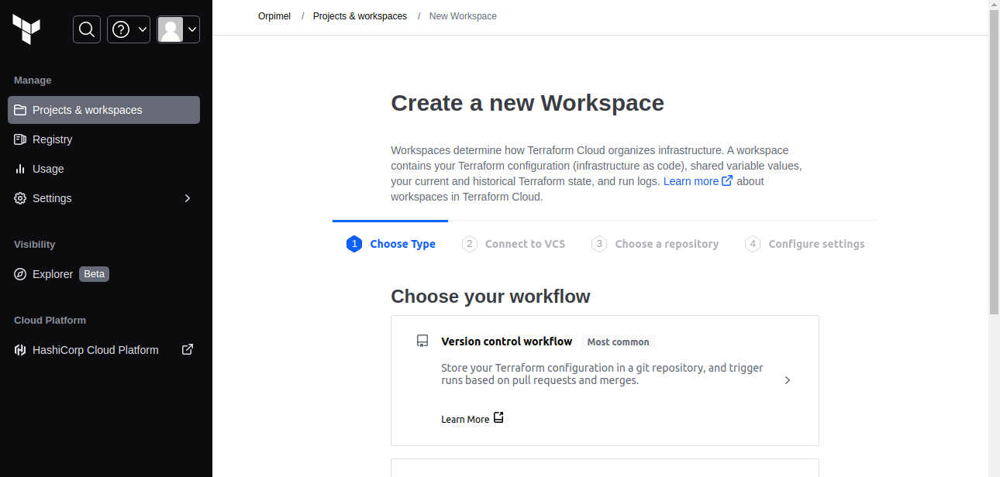
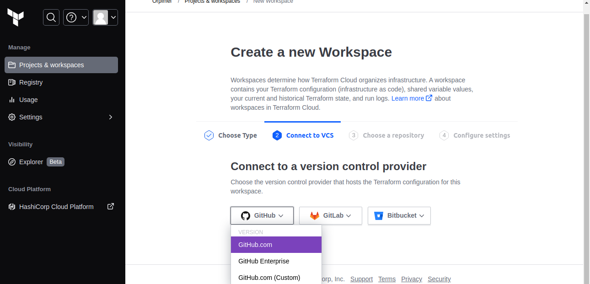
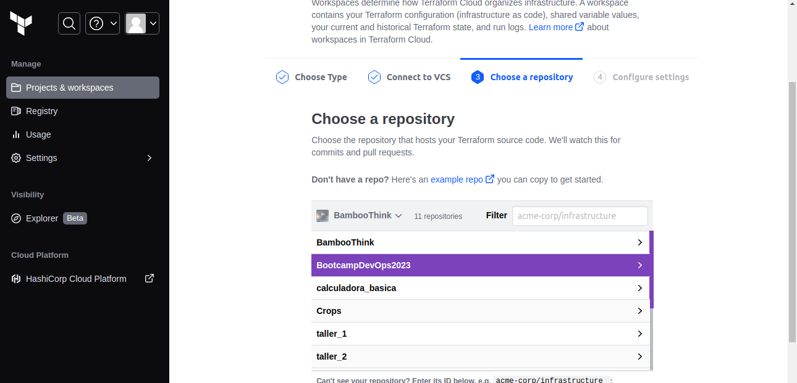
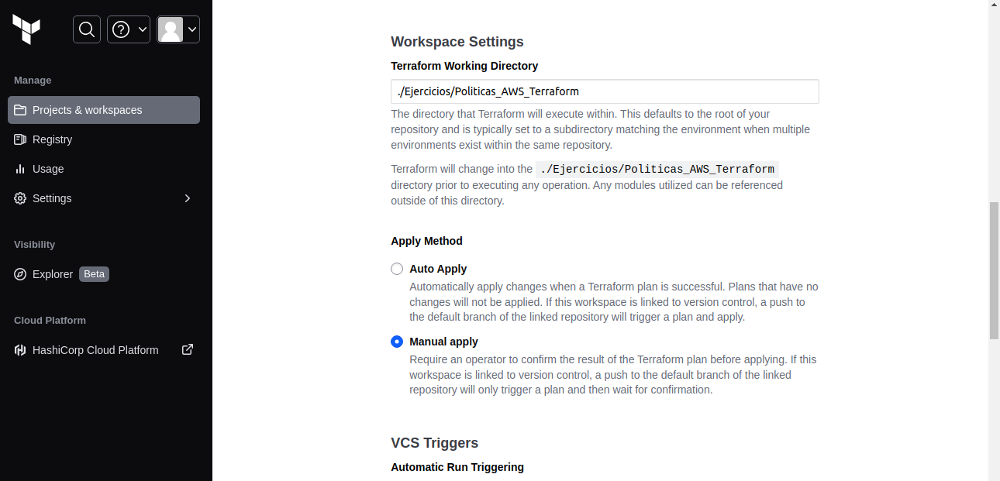
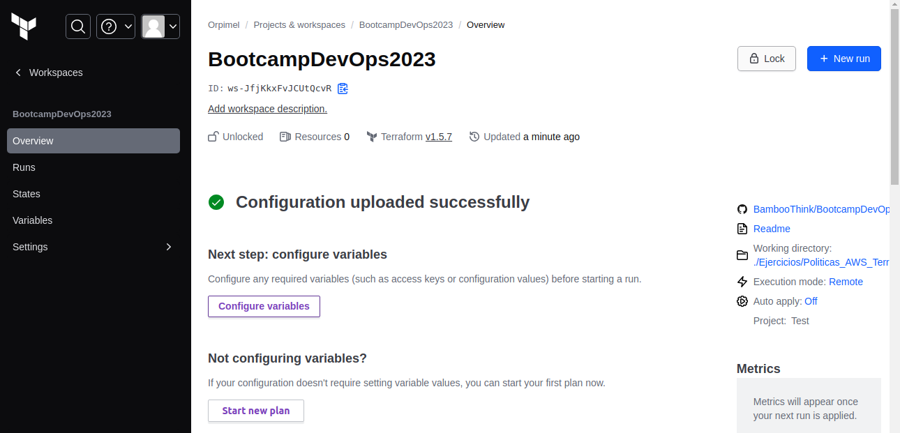
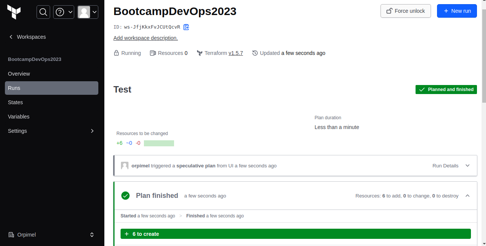
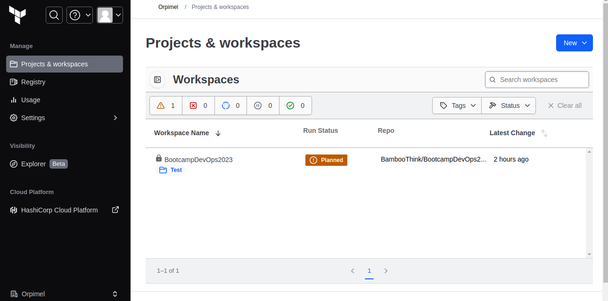

# Prueba de Terraform Cloud

En este ejercicio se observará la configuración y ejecución de un plan de Terraform en Terraform Cloud.

### 1. Se crea un Proyecto y luego un Workspace

#### 1.1 Para este ejemplo se selecciona _Version Control Workflow_

#### 1.2 Se conecta con un VCS (Version Control System)

#### 1.3 Se selecciona el repositorio

#### 1.4 Se asigna al Proyecto creado inicialmente, en _Apply Method_ se selecciona _Manual Apply_ (recomendado) y en _VCS Branch_ la rama _main_. Por último, en _Terraform Working Directory_ se indica la carpeta donde se encuentra el código de Terraform.

### 2. Se ingresa al Workspace creado y se configuran las credenciales de AWS en la parte de variables.

### 3. Se ejecuta el plan y se observa el resultado.

