# Kong Gateway - Desafío 11

### Actividades

Haciendo uso de lo visto en clase deberás realizar la publicación de la siguiente API Pública:

https://gameofthronesquotes.xyz/

1. Desplegar una instalación de KONG en Minikube.
2. Publicar una API haciendo la definición del servicio y router mediante el Admin API de Kong.
3. Mediante algún cliente REST/CURL validar el funcionamiento del API Gateway llamando al método https://api.gameofthronesquotes.xyz/v1/author/tyrion/2. Acordate de actualizar la URL para que implemente tu API Gateway.
4. Agregar algún mecanismo de autenticación del lado del API Gateway.

### Entregables

1. Explique cada uno de los pasos que se realizaron para instalar el producto KONG en minikube.
2. Muestre y liste los comandos CURL utilizados para publicar la API propuesta.
3. Informe los comandos CURL que se ejecutaron para realizar las pruebas, recuerda que tiene que existir una llamada a la API con autenticación.
4. Diagrama de alto nivel de cómo están desplegados los componentes.

### Solución

1. Se inicia Docker Desktop `systemctl --user start docker-desktop` y se inicia minikube `minikube start`.

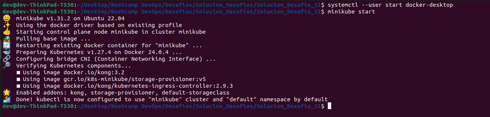

2. Se crea el namespace `kong` con el comando `kubectl create namespace kong`.

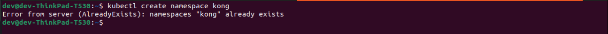

3. Se crean las variables de credenciales y configuración:

```bash
kubectl create secret generic kong-config-secret -n kong \
--from-literal=portal_session_conf='{"storage":"kong","secret":"super_secret_salt_string","cookie_name":"portal_session","cookie_same_site":"Lax","cookie_secure":false}' \
--from-literal=admin_gui_session_conf='{"storage":"kong","secret":"super_secret_salt_string","cookie_name":"admin_session","cookie_same_site":"Lax","cookie_secure":false}' \
--from-literal=pg_host="enterprise-postgresql.kong.svc.cluster.local" \
--from-literal=kong_admin_password=kong \
--from-literal=password=kong
```

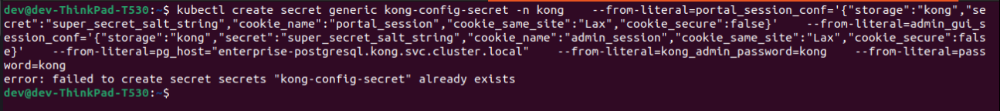

4. Se crea un secreto de licencia para Kong Gateway Free Mode:
    
```bash
kubectl create secret generic kong-enterprise-license --from-literal=license="'{}'" -n kong --dry-run=client -o yaml | kubectl apply -f -
```

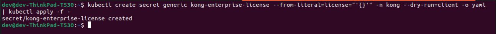

5. Se agrega el repositorio de Helm de Jetstack Cert Manager `helm repo add jetstack https://charts.jetstack.io ; helm repo update`.

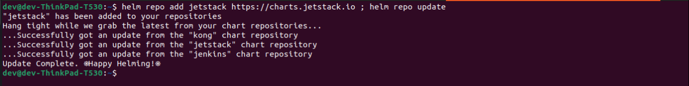

6. Se instala Cert Manager `helm upgrade --install cert-manager jetstack/cert-manager \ --set installCRDs=true --namespace cert-manager --create-namespace`.

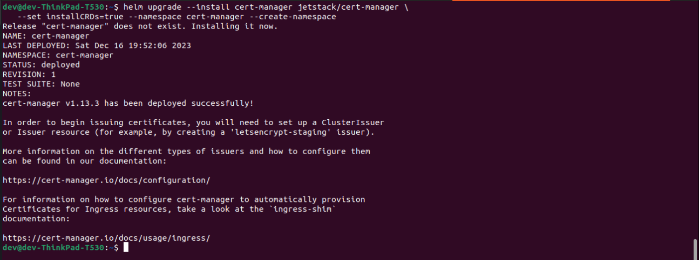

7. Se crea un emisor de certificado autofirmado:

```bash
bash -c "cat <<EOF | kubectl apply -n kong -f -
apiVersion: cert-manager.io/v1
kind: Issuer
metadata:
name: quickstart-kong-selfsigned-issuer-root
spec:
selfSigned: {}
---
apiVersion: cert-manager.io/v1
kind: Certificate
metadata:
name: quickstart-kong-selfsigned-issuer-ca
spec:
commonName: quickstart-kong-selfsigned-issuer-ca
duration: 2160h0m0s
isCA: true
issuerRef:
group: cert-manager.io
kind: Issuer
name: quickstart-kong-selfsigned-issuer-root
privateKey:
algorithm: ECDSA
size: 256
renewBefore: 360h0m0s
secretName: quickstart-kong-selfsigned-issuer-ca
---
apiVersion: cert-manager.io/v1
kind: Issuer
metadata:
name: quickstart-kong-selfsigned-issuer
spec:
ca:
secretName: quickstart-kong-selfsigned-issuer-ca
EOF"
```

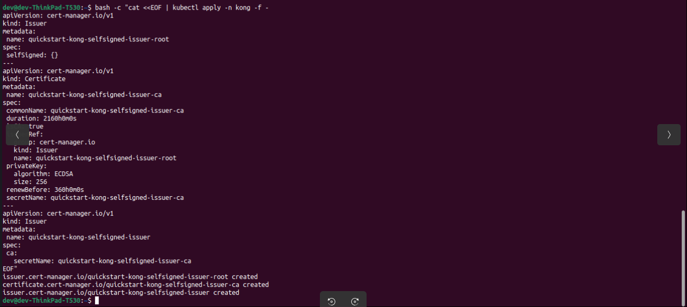

8. Se agrega el repositorio de Helm de Kong `helm repo add kong https://charts.konghq.com ; helm repo update`.

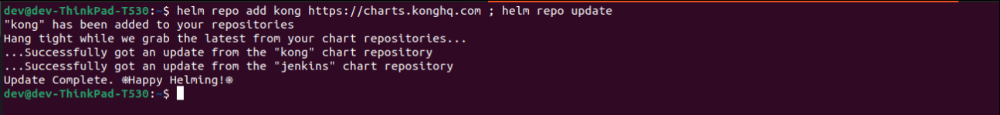

9. Se instala Kong `helm install quickstart kong/kong --namespace kong --values https://bit.ly/KongGatewayHelmValuesAIO`.

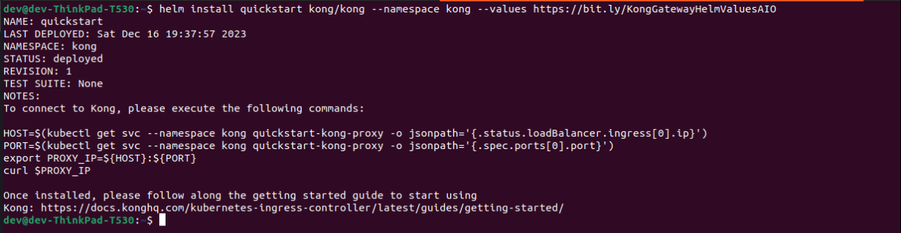

10. Se espera a que los pods estén completados y corriendo. Para ello se ejecuta `kubectl get po --namespace kong -w`.

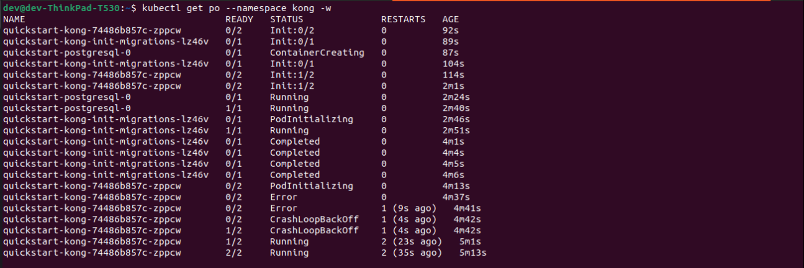

11. Se habilita Kong Ingress Controller mediante el comando `minikube addons enable kong`.


12. Se ejecuta `minikube tunnel` para habilitar el acceso a la API desde el exterior.

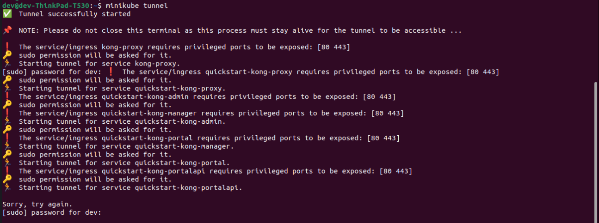

13. Se valida el funcionamiento del Kong Ingress Controller (KIC) mediante la ejecución del comando `curl -v localhost`.


14. Se crea un servicio mediante el Admin API de Kong:

```bash
curl -i -s -X POST http://localhost:8001/services \
--data name=service_game_of_thrones \
--data url='https://api.gameofthronesquotes.xyz/v1/author/tyrion/2'
```

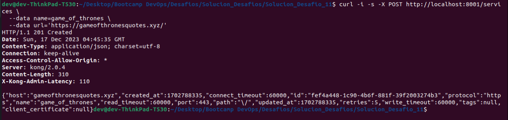

**Forma de eliminar un servicio:** `curl -i -X DELETE http://localhost:8001/services/nombre_servicio`.

15. Se crea una ruta mediante el Admin API de Kong:

```bash
curl -i -X POST http://localhost:8001/services/service_game_of_thrones/routes \
--data 'paths[]=/quotes' \
--data 'methods[]=GET' \
--data name=route_game_of_thrones
```

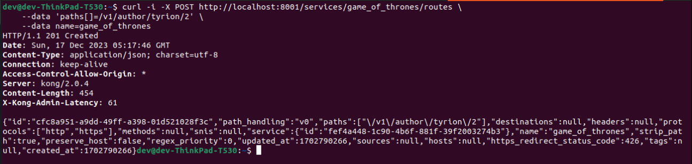

**Forma de eliminar una ruta:** `curl -i -X DELETE http://localhost:8001/services/nombre_ruta`.

16. Se valida el funcionamiento mediante Postman o cURL:

```bash
curl --location 'http://localhost:8000/quotes'
```

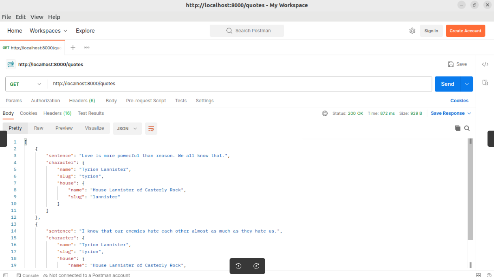

17. Se configura un consumidor con su respectiva clave:

```bash
curl -i -X POST http://localhost:8001/consumers/ \
--data username=marco
```

```bash
curl -i -X POST http://localhost:8001/consumers/marco/key-auth
```

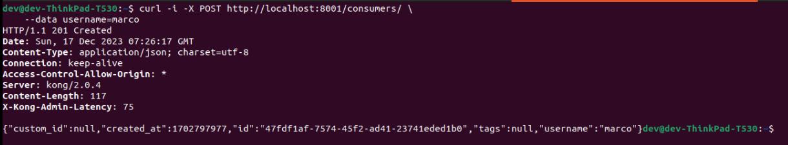

18. Se habilita la autenticación de clave global mediante el Admin API de Kong:

```bash
curl -X POST http://localhost:8001/plugins/ \
--data "name=key-auth"  \
--data "config.key_names=apikey"
```

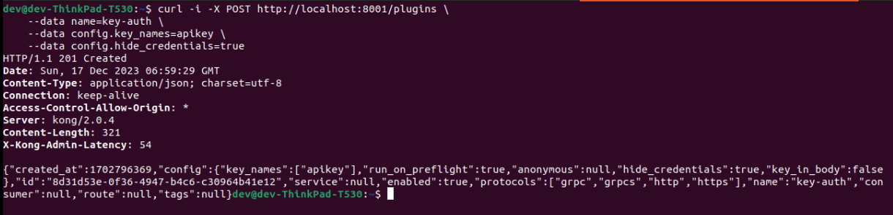

19. Se valida la restricción (código de estado de respuesta HTTP 401) mediante la ejecución del comando `curl -i http://localhost:8000/quotes`.


20. Se valida el consumo de la API empleando la clave generada en el paso No. 17:

```bash
curl -i http://localhost:8000/quotes -H 'apikey:UT6Lr2huYG8v6qo0UMS3dhjxqzLDZN8W'
```

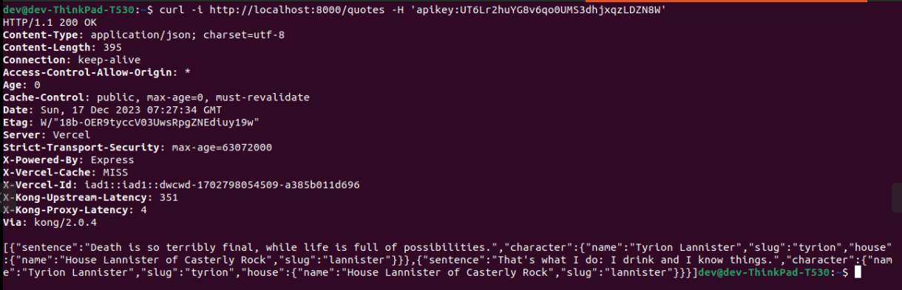

**Nota:** La creación de los servicios y rutas se puede realizar mediante archivos YAML, pero en este caso se realizó mediante el Admin API de Kong. A continuación se listan los comandos para generar los archivos YAML de ejemplo:

1. Se ejecuta `snap install kong` para instalar Kong Studio.
2. Se ejecuta `kong config init` para crear el archivo de configuración.

### Presentación PDF

[Solución Desafio 11 - Marco Vanegas.pdf](Solución_Desafio_11_-_Marco_Vanegas.pdf).